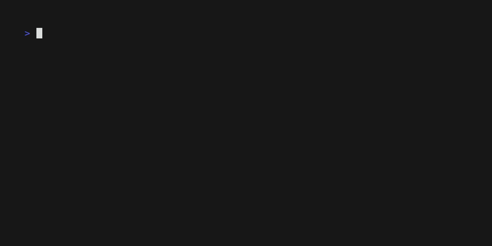

# @kurrent/gaffer

The command-line toolkit for [KurrentDB](https://www.kurrent.io) projections. Scaffold, run, debug, and deploy projections from your terminal.

KurrentDB projections are server-side JavaScript that derive new streams and state from existing events. Gaffer runs them locally against the same JavaScript engine KurrentDB uses, so a projection that passes here passes in production.

## Install

```sh
npm install -g @kurrent/gaffer
```

Requires Node.js 22 or later. Platform binaries are pulled in as optional dependencies; no separate runtime install is needed.

## Quick start

Try the bundled demo:

```sh
git clone https://github.com/kurrent-io/gaffer
cd gaffer/demo
gaffer dev order-count --fixture happy
```

The CLI replays the events declared as `fixtures.happy` in [`demo/gaffer.toml`](https://github.com/kurrent-io/gaffer/tree/main/demo) through the `order-count` projection and prints the resulting state. No running KurrentDB instance is needed.



Or start a new project from scratch:

```sh
gaffer init                  # create gaffer.toml and .gaffer/
gaffer scaffold order-count  # add projections/order-count.js
```

See the [getting started guide](https://docs.kurrent.io/gaffer/getting-started/) for a full walkthrough including fixtures, editor setup, and the dev loop.

## Commands

| Command                    | What it does                                                                |
| -------------------------- | --------------------------------------------------------------------------- |
| `gaffer init`              | Create `gaffer.toml`, `.gitignore`, and `.gaffer/` in the current directory |
| `gaffer scaffold <name>`   | Add a new projection to the project                                         |
| `gaffer dev <projection>`  | Run a projection against fixtures, an events file, or a live KurrentDB      |
| `gaffer info <projection>` | Show projection details                                                     |
| `gaffer mcp`               | Start an MCP server for AI agent integration                                |
| `gaffer lsp`               | Run the Language Server Protocol server over stdio                          |
| `gaffer config`            | Manage user-level configuration (telemetry, identity)                       |
| `gaffer version`           | Print the gaffer version                                                    |

Run `gaffer <command> --help` for flags and options, or see the [full command reference](https://docs.kurrent.io/gaffer/cli/).

## Configuration

Project settings live in `gaffer.toml` at the project root:

```toml
connection = "kurrentdb+discover://localhost:2113"
engine_version = 2

[[projection]]
name = "order-count"
entry = "projections/order-count.js"
fixtures.happy = "fixtures/orders.json"
```

User-level settings (telemetry opt-out, identity) live in `~/.config/gaffer/config.toml` and are managed with `gaffer config`. See the [configuration reference](https://docs.kurrent.io/gaffer/cli/gaffer-toml) for every option.

## Editor integration

Gaffer ships with Language Server Protocol and Debug Adapter Protocol servers, plus a VS Code extension that wires them up automatically.

- **VS Code** - install the [KurrentDB Projections extension](https://marketplace.visualstudio.com/items?itemName=kurrent-io.gaffer) for inline diagnostics, run/debug codelens above `gaffer.toml` projections, and breakpoint debugging.
- **Other editors** - run `gaffer lsp` over stdio for LSP integration. See the [editor setup guide](https://docs.kurrent.io/gaffer/getting-started/editor-setup) for examples.

## AI agent integration

`gaffer mcp` exposes scaffolding, validation, debugging, and the projection API as Model Context Protocol tools and resources. Compatible with Claude Code, Cursor, Continue, GitHub Copilot, and any other MCP client.

See the [MCP integration guide](https://docs.kurrent.io/gaffer/mcp/) for client setup.

## Related packages

| Package                                                                                                    | What it is                                                                           |
| ---------------------------------------------------------------------------------------------------------- | ------------------------------------------------------------------------------------ |
| [`@kurrent/projections-testing`](https://www.npmjs.com/package/@kurrent/projections-testing)               | Library for testing projections from your existing test runner (vitest, jest, mocha) |
| [KurrentDB Projections for VS Code](https://marketplace.visualstudio.com/items?itemName=kurrent-io.gaffer) | Editor integration with debugger, codelens, and MCP server                           |

## Telemetry

Gaffer collects anonymous usage telemetry by default. See [TELEMETRY.md](https://github.com/kurrent-io/gaffer/blob/main/cli/TELEMETRY.md) for the full list of what is collected and how to opt out (`gaffer config telemetry off`).

## Documentation

Full documentation at <https://docs.kurrent.io/gaffer/>.

Bugs go to [GitHub Issues](https://github.com/kurrent-io/gaffer/issues). Questions and feature requests to [Discussions](https://github.com/kurrent-io/gaffer/discussions).

## License

[Kurrent License v1](LICENSE)
